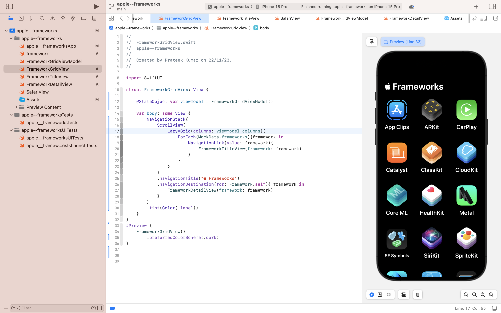
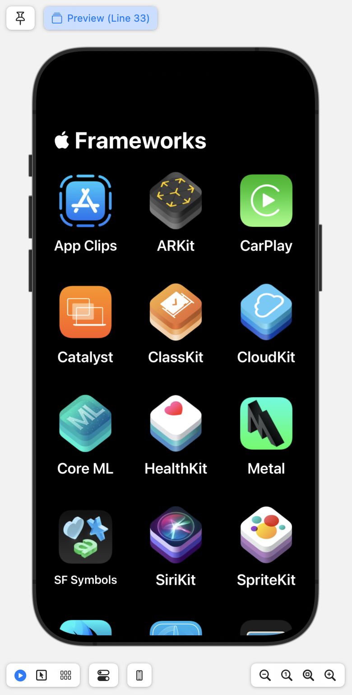
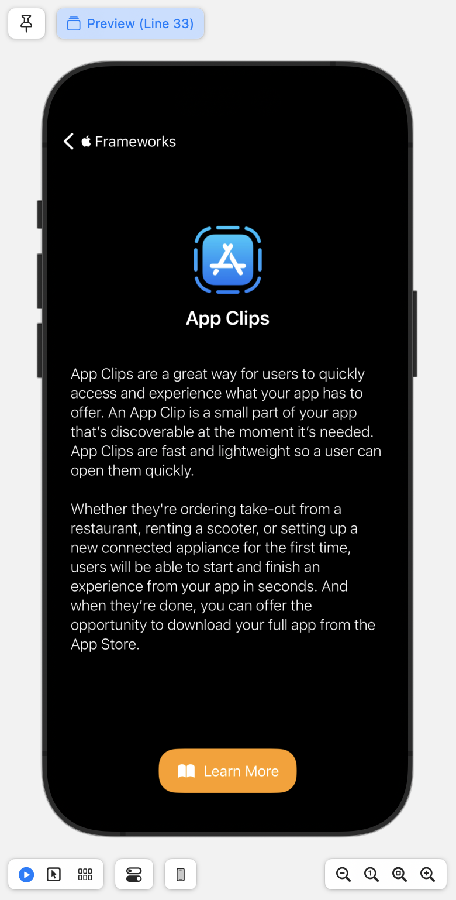

# Apple Frameworks Showcase App

## Description

This iOS app is a beginner-level project developed using SwiftUI to explore fundamental concepts such as views, navigation stack, state & bindings, data flow, and grid views. The app showcases various Apple frameworks in a grid view. When you click on a framework, a detailed screen appears with a brief introduction to the framework. Additionally, a button is provided to redirect users to the official Apple website for an in-depth exploration of the selected framework.

## Screenshots

  
  

## Screen Recording
[Watch The App!](https://github.com/Prateekkhohal/apple--frameworks/assets/111964887/d9e17fe3-6b99-4d22-8ac5-cfe0cb56c26d)

## Features

- Grid view of Apple frameworks.
- Detailed screens for each framework with a brief introduction.
- External link button to the official Apple website for more information.

## Installation

To run the app, make sure you have the latest version of Xcode installed. Clone the repository and open the project file in Xcode.
